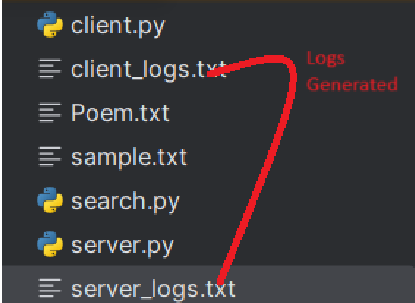

# Project -  🌐  Network-based pattern searching

## 📖 Project Overview
This project is a network-based pattern-searching application that enables users to find specific words or patterns within text files in the directory.
It consists of a server-client architecture, where the server processes search requests and returns the results to the client. 
The client features a user-friendly GUI built with Tkinter, making interacting with the application easy.
You can also refer to the attached PDF for the project requirements.

### 🌟 Features
- **🖥️ Multi-threaded Server**: Handles multiple client requests simultaneously.
- **🔍 Search Functionality**: Searches for words or patterns in a specified text file.
- **⚠️ Error Handling**: Robust error handling to manage file not found scenarios and invalid search patterns.
- **📝 Logging**: Logs client and server actions for better monitoring.
- **💻 User-Friendly GUI**: Intuitive interface for entering search parameters.

## ⚙️ Technologies Used
- Python
- Socket Programming
- Tkinter for GUI 
- JSON for data exchange
- Regular Expressions for text processing
- Multi-threading for concurrent processing
- Logging for tracking operations

## 🚀 How to Run the Application
### 1. Clone the Repository
If you haven't already, clone the repository to your local machine:
-git clone <repository_url>
-cd <repository_directory>

### 2. Run the Server 
Open a terminal and navigate to the project directory, then execute: python server.py
The server will listen for incoming client connections.

### 3. Run the Client
Open another terminal and execute: python client.py
- If you don't have Tkinter available on your system, you can install it using cmd ==> pip install tk

### 4. Usage
Enter the filename (e.g., sample.txt) and the search word/pattern in the client GUI. ( Bydefault sample.txt exist, even though if you not specified any filename.)
- Pattern/Words can't be blank.
Click the "Search" button to view the results.

### 5. Log Files
Check client_logs.txt and server_logs.txt for detailed logs of operations and errors.

## 📸 Screenshots
### Server GUI

### Client GUI

### Log

## 📚 References
To deepen your understanding of the technologies used in this project, while doing the project, I used the following websites to understand them in depth:
 - Socket Programming 🛠 https://www.tutorialspoint.com/python/python_socket_programming.htm and https://realpython.com/python-sockets/ 
 - Logging in Python 📜 https://docs.python.org/3/howto/logging.html
 - Multi-threading in Python 🧵 https://www.javatpoint.com/multithreading-in-python-3 
 - Regular Expressions in Python 🔍 https://docs.python.org/3/howto/regex.html 
 - Error Handling in Python ❗ https://www.datacamp.com/tutorial/exception-handling-python 
 - File Handling in Python 📁 https://www.tutorialspoint.com/python/python_file_handling.htm 
 - Working with JSON in Python 🗂️ https://realpython.com/python-json/
 - Creating GUI Applications with Tkinter 🎨 https://realpython.com/python-gui-tkinter/
 - https://peps.python.org/pep-0008/ 

## 🌟 Collaborators
This project is a collaborative effort between Shivam Kumar and Ranjan Kumar, reflecting our joint contribution and teamwork.
